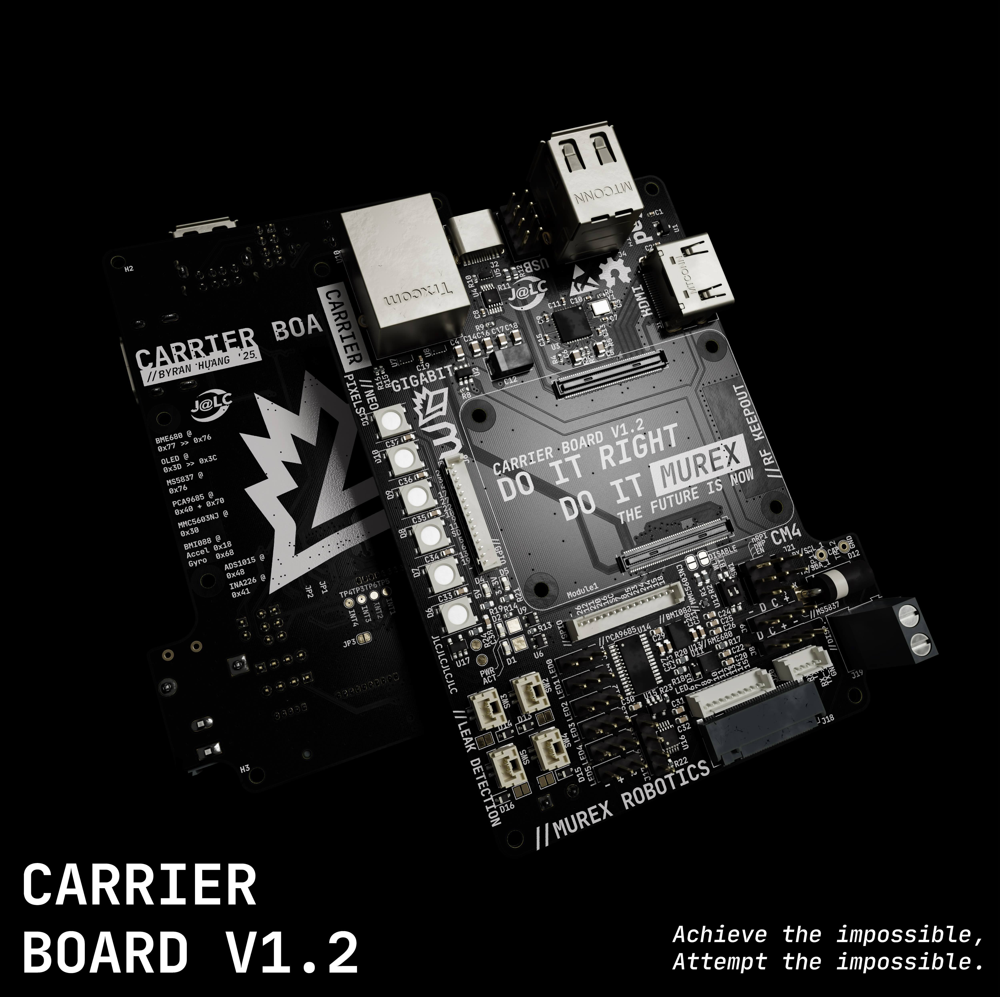

# Carrier Board

## Outline

The MUREX Carrier Board is the world's first open-source CM4-based ROV (robotics) control board.

With a physical footprint of 110 mm x 73mm (4.33 in x 2.88 in), the MUREX Carrier Board is suitable for highly compact applications. Note that this board is heavily reliant on the MUREX Power Board, connected through the M.2 (Key A) connector.

## Detailed Description

The MUREX Carrier Board is a four-layer carrier board for the Raspberry Pi Compute Module 4, designed for ROV/robotics applications. The design is highly specific for ROV control, utilizing a PCA9685 16 channel PWM driver, BME680 environmental sensor, a MEMS sensor that combines the BMI088 accelerometer and gyroscope along with a MMC5603NJ magnetometer, and a header pin array for the MS5837 underwater pressure sensor. *All GPIO pins are broken out through the two 1x15 vertical Picoblade connectors.* The MUREX Carrier Board offers many status and debugging features, such as hard resets toggles, wireless communication toggles, Neopixel array, piezoelectric buzzer, I2C screen and a leak detection matrix. The board is equipped with Gigabit Ethernet, 4x USB 2.0 (2x USB-A, 2x 1x5 header pins), USB-C (CC1/CC2 pulled low with 5.1kΩ resistors), and HDMI. The MUREX Carrier Board is also designed for highly embedded applications in mind, with direct 5V input, small physical footprint, extensive hardware configurations, and ample mounting positions. Please note that for space efficiency, it does not do any on-board power management. The MUREX Carrier Board expects clean, protected +5V input, such as provided by the [MUREX Power Board](https://docs.murexrobotics.com/elec/boards/power.html).

CM4 Specific Features:

- 1x HDMI
- 4x USB 2.0 as `host`
- 1x USB-C as `device`
- 1x Giagbit ethernet (no POE)
- Hardware BT/Wi-Fi disable toggles
- Two pairs of I2C and UART lanes, as per [the programming communication standards](https://docs.murexrobotics.com/prog/communication.html)
- All standard Raspberry Pi GPIO accessible through two 1x5 Picoblade connectors

### Current Status

- `V1.1` complete, fully tested
  - New revisions for `V1.2` in progress

### Integrated Sensors/ICs

- [PCA9685](https://www.nxp.com/docs/en/data-sheet/PCA9685.pdf) (PWM)
  - Wide range of control for ESCs, servos or any other PWM device
- [BME680](https://www.bosch-sensortec.com/media/boschsensortec/downloads/datasheets/bst-bme680-ds001.pdf) (Enclosure Pressure, Humidity, Temperature, VOC)
  - Accurate environmental sensor within enclosure
- [MMC5603NJ](https://www.memsic.com/Public/Uploads/uploadfile/files/20220119/MMC5603NJDatasheetRev.B.pdf) (Magnetometer) and `BMI088` (IMU)
  - High accuracy 9-DOF MEMS sensor (±1˚ magnetic heading, ±0.004˚/s gyroscopic heading, ±0.09 mg acceleration)
- [MS5837](https://www.te.com/commerce/DocumentDelivery/DDEController?Action=showdoc&DocId=Data+Sheet%7FMS5837-30BA%7FB1%7Fpdf%7FEnglish%7FENG_DS_MS5837-30BA_B1.pdf%7FCAT-BLPS0017) (Environmental Pressure)
  - High accuracy, high depth pressure sensor (±2 mm altitude/depth, ±1 C˚ temperature)
- [ADS1015](https://www.ti.com/lit/ds/symlink/ads1015.pdf?ts=1689121509566&ref_url=https%253A%252F%252Fwww.ti.com%252Fproduct%252FADS1015) (ADC)
  - High accuracy, LDO filtered power, 12-bit 4 channel ADC. Reads hall effect current sense data from power board. 3 additional, expandable ADC pins.
- [Neopixel/WS2812B](https://cdn-shop.adafruit.com/datasheets/WS2812B.pdf) (Debug/Status)
  - 6 daisy chained WS2812B LEDs
- [TDK Buzzer](https://product.tdk.com/en/system/files?file=dam/doc/product/sw_piezo/sw_piezo/piezo-buzzer/catalog/piezoelectronic_buzzer_ps_en.pdf) (Debug/Status)
- Adafruit Screen (Debug/Status)
- 5V and 3.3V power rail LEDs (Debug/Status)
- PWR and ACT CM4 LEDs (Debug/Status)
- Leak detection 2x2 high precision matrix
  - Intended to work with the Blue Robotics Leak Sensors or any other JST-GH size sensor (ROV-specific)
  - Pinpointing the leak with the anti-ghosting technology inspired from high-end gaming keyboards

### [Schematic (PDF)](../pdf/schematics/carrier_v1.1_schematic.pdf)

### To Do

- [ ] Amplification required for leak detection matrix? (still unsure)
- [ ] Wire HW interrupts for BMI088
- [ ] SPI BMI088
- [ ] External magnetics for Ethernet
  - [ ] Currently deciding
  - [X] Work in progress

### Changelog

V1.0:

- Initial design

V1.1:

- Added I2C line to power board
- Moved R11 + R12 (5.1kΩ USB-C CC1 and CC2 resistors) and C19 (Ethernet capacitor) away from Ethernet connector due to SMT issues
- Fixed R11 and R12 LCSC part number to match 0603 footprint sizing
- Widened USB VBUS to 1.0mm

| Design               | Status |
| -------------------- | ------ |
| Physical Parity      | ✅     |
| Electrical Parity    | ❌     |
| Backwards Compatible | ❌     |
| Component Compatible | ✅     |
| Schematic Changes    | ✅     |
| PCB Changes          | ✅     |
