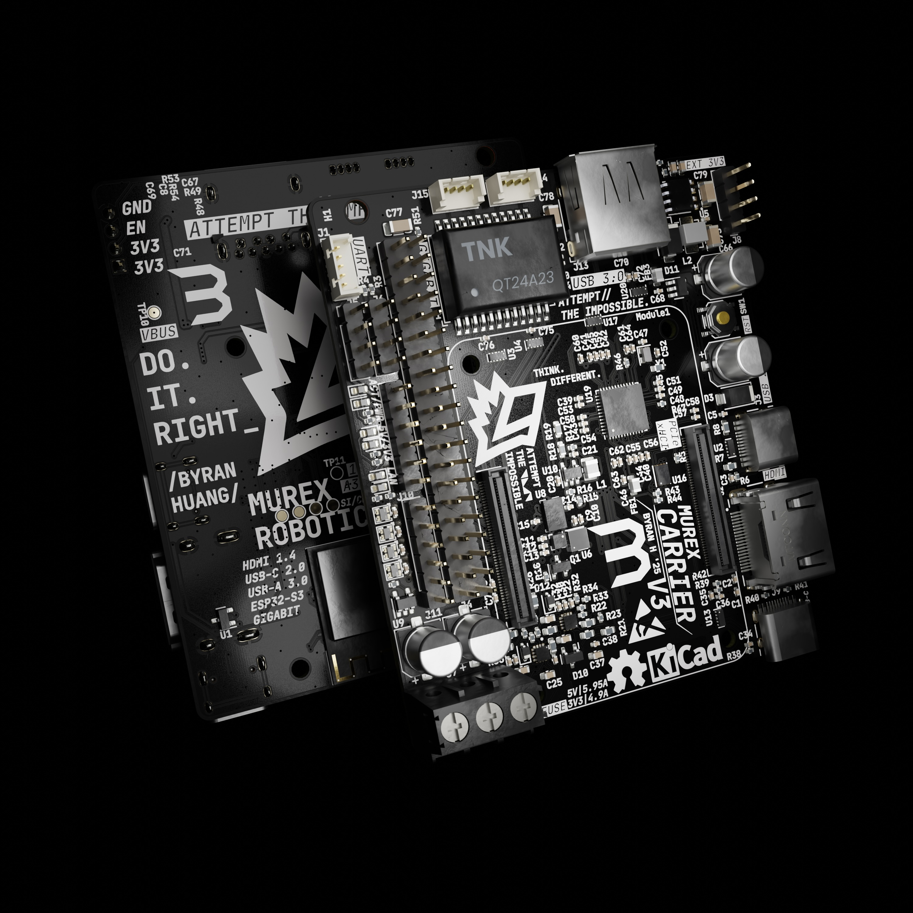
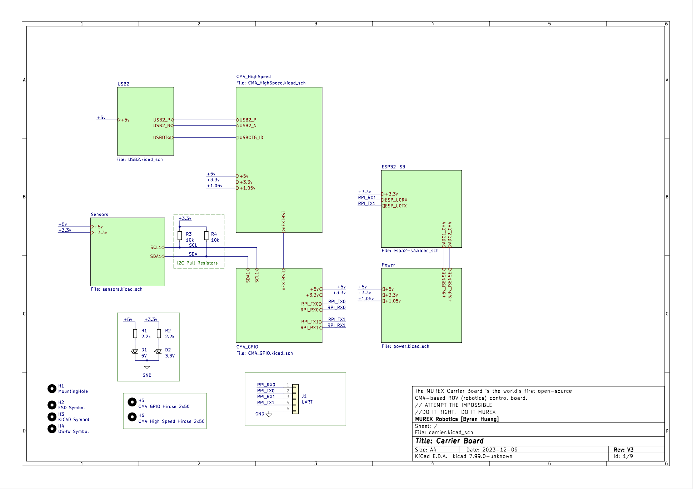

# Carrier Board

## Outline

The MUREX Carrier Board is a robotics control system, focused on ROV systems. It is the world's first open-source CM4-based ROV control board, world's first open-source USB3.0 controller implementation, and low-cost.

With a physical footprint of 78 mm x 68 mm (3.07 in x 2.68 in), the MUREX Carrier Board is suitable for embedded and space-limited applications.

## Detailed Description

The MUREX Carrier Board is a robotics-oriented application of the Raspberry Pi Compute Module 4, optimized for ROV control. The design utilizes an ESP32-S3 module, BME680 environmental sensor, LIS3MDL magnetometer, and BMI088 inertial measurement unit (IMU), allowing for a 9 DoF AHRS, full array gas sensing, IEEE 802.11b/g/n (2.4 GHz Wi-Fi), and Bluetooth® 5 (LE). The power input consists of dual TPS259474LRPWR eFuses for 3.3V and 5V, offering OVLO, UVLO, OC, slew rate control, reverse polarity, and analog current monitoring. In addition to 5V and 3.3V input, onboard high-efficiency DC-DC converters allow for high power 3.3V and 1.05V output. The uPD720202 xHCI USB3.0 interface allows for SuperSpeed USB connectivity and external Ethernet magnetics enable compact Gigabit ethernet. The co-processor design implementing the ESP32-S3 enables wireless capabilities for non-ROV applications and wider GPIO capabilities. All vital data lines are protected against transients. There are on-board system feedback LEDs for input power, Ethernet and CM4 activity/power. Four user-addressable RGB LEDs, modified 40-pin BCM GPIO, 8x ADC, and multiple I2C/SPI lines available across the ESP32 and CM4 enable the MUREX Carrier Board to be a fully-featured ROV control system

### Current Status

- `V1.1` tested and functional
- `V3` tested and functional

### Integrated Sensors/ICs

- [ESP32-S3-MINI-1](https://www.espressif.com/sites/default/files/documentation/esp32-s3-mini-1_mini-1u_datasheet_en.pdf) (Co-Processor)
  - Low-power MCU-based system on a chip (SoC) with integrated 2.4 GHz Wi-Fi and Bluetooth® Low Energy (Bluetooth LE)
- [BME680](https://www.bosch-sensortec.com/media/boschsensortec/downloads/datasheets/bst-bme680-ds001.pdf) (Enclosure Pressure, Humidity, Temperature, VOC)
  - Accurate environmental sensor within enclosure
- [LIS3MDL](https://www.st.com/en/mems-and-sensors/lis3mdl.html) (Magnetometer) and [BMI088](https://www.bosch-sensortec.com/products/motion-sensors/imus/bmi088/) (IMU)
  - High accuracy 9-DOF MEMS sensor (±1˚ magnetic heading, ±0.004˚/s gyroscopic heading, ±0.09 mg acceleration)
- [MS5837](https://www.te.com/commerce/DocumentDelivery/DDEController?Action=showdoc&DocId=Data+Sheet%7FMS5837-30BA%7FB1%7Fpdf%7FEnglish%7FENG_DS_MS5837-30BA_B1.pdf%7FCAT-BLPS0017) (Environmental Pressure)
  - High accuracy, high depth pressure sensor (±2 mm altitude/depth, ±1 C˚ temperature)
- [SK6812-EC20 (Neopixel)](http://www.normandled.com/upload/202003/SK6812-EC20%20LED%20Datasheet.pdf) (Debug/Status)
  - 4 daisy-chained SK6812-EC20 RGB LEDs
- [TPS259474LRPWR](https://www.ti.com/lit/ds/symlink/tps25947.pdf) (eFuse)
  - 5V and 3.3V independent input protection
- [uPD720202](https://www.renesas.com/us/en/products/interface/usb-switches-hubs/upd720202-usb-30-host-controller) (USB 3.0)
  - USB host controller LSI compatible with the USB 3.0 and xHCI (eXtensible Host Controller Interface) 1.0 specifications
- [AP3429KTTR-G1](https://www.diodes.com/assets/Datasheets/AP3429.pdf) (1.05V DC-DC Converter)
  - 1MHz 2A DC-DC converter
- [TPS54331DRA](https://www.ti.com/lit/ds/symlink/tps54331.pdf) (3.3V DC-DC Converter)
  - 570KHz 3A non-synchronous buck converter
- Full system protection on power rails
- Transient protection on vital data lines
- 5V and 3.3V power rail LEDs (Debug/Status)
- PWR and ACT CM4 LEDs (Debug/Status)
- Ethernet G/Y LEDs (Debug/Status)

### [V3 Schematic (PDF)](/pdf/schematics/carrier_v3_schematic.pdf)

- [V1.0 Schematic (PDF)](/pdf/schematics/carrier_v1.0_schematic.pdf)
- [V1.1 Schematic (PDF)](/pdf/schematics/carrier_v1.1_schematic.pdf)

### To Do

### Changelog

V1.0:

- Initial design

V1.1:

- Added I2C line to power board
- Moved R11 + R12 (5.1kΩ USB-C CC1 and CC2 resistors) and C19 (Ethernet capacitor) away from Ethernet connector due to SMT issues
- Fixed R11 and R12 LCSC part number to match 0603 footprint sizing
- Widened USB VBUS to 1.0mm

| Design               | Status |
| -------------------- | ------ |
| Physical Parity      | ✅     |
| Electrical Parity    | ❌     |
| Backwards Compatible | ❌     |
| Component Compatible | ✅     |
| Schematic Changes    | ✅     |
| PCB Changes          | ✅     |

V2:

- Removed extra edge for screw terminal, compacted design

| Design               | Status |
| -------------------- | ------ |
| Physical Parity      | ❌     |
| Electrical Parity    | ✅     |
| Backwards Compatible | ❌     |
| Component Compatible | ✅     |
| Schematic Changes    | ❌     |
| PCB Changes          | ✅     |

V3:

- Complete redesign, now using
  - uPD720202 USB 3.0 xHCI host controller
  - Dual buck converter designs with
    - 5V to 1.05V step down with the AP3429
    - 5V to 3.3V step down with the TPS54331
  - Decreased size of addressable LED array with SK6812-EC20 RGB LEDs
  - Replaced MMC5603 with the LIS3MDL
  - Retained BMI088 and BME680 sensors
  - Retained HDMI capability
  - Implemented a dual architecture design with an ESP32-S3-MINI-1 coprocessor
    - Enables 8 channels of ADC, multiple I2C/SPI lines, standard GPIO, Bluetooth 5 (LE), IEEE 802.11b/g/n and dual-core Xtensa 32-bit LX7 microprocessors
  - Modified 40 pin GPIO
  - Selectable independent 3.3V and 5V inputs, protected with TPS259474LRPWR eFuses
  - External gigabit magnetics
  - USB-C USB 2.0 host to save space
  - Robust transient protection on all data and power lines

| Design               | Status |
| -------------------- | ------ |
| Physical Parity      | ❌     |
| Electrical Parity    | ❌     |
| Backwards Compatible | ❌     |
| Component Compatible | ❌     |
| Schematic Changes    | ✅     |
| PCB Changes          | ✅     |

V3.1:

- Flipped TX/RX on the ESP32
- Pulling overcurrent detection high on the uPD720202
- Output capacitor for the AP3429
- Replaced ESP32S3 JTAG pins with GPIO

| Design               | Status |
| -------------------- | ------ |
| Physical Parity      | ✅     |
| Electrical Parity    | ❌     |
| Backwards Compatible | ✅     |
| Component Compatible | ❌     |
| Schematic Changes    | ✅     |
| PCB Changes          | ✅     |
