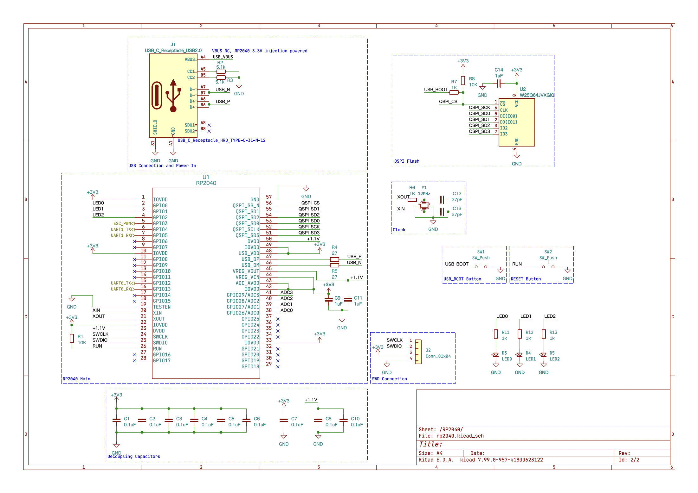
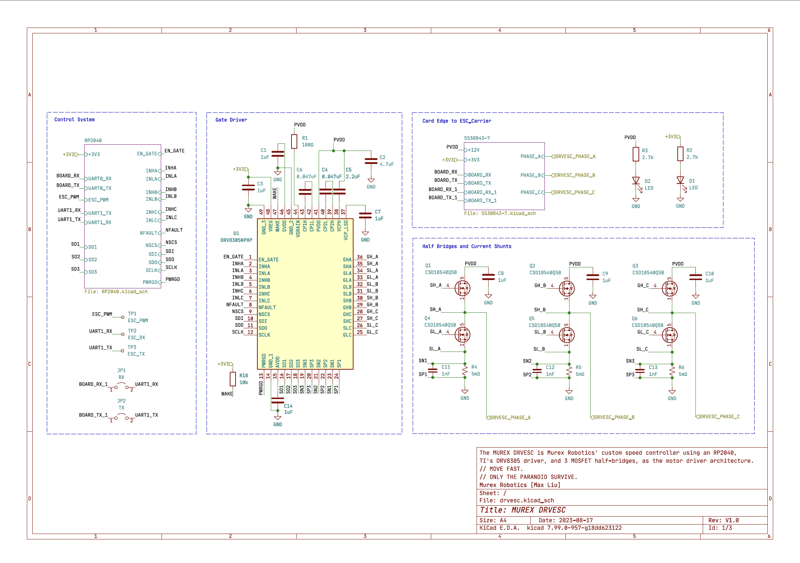

# ESC

## Outline

The MUREX ESC module is one of the first ESC agnostic speed controlling systems. It is a compact, high power electronic speed controller (ESC) control board, paired with a general purpose MCU to allow for "universal" compatibility. This allows a variety of modules to be used to fit the application, or allow for rapid replacement in the event of a device failure.

## Current Status

- ANYESC `V1` tested and functional
- DRVESC `V1` experimental status

## Detailed Description

There are plans to have multiple, independent versions of this board, hence its "module" name. More modules will be listed below as designs arise.

- "ANYESC" module  ––>  Commercial ESC + RP2040
  - This ESC design utilizes a standard single ESC mounting size to accommodate almost every commercial single ESC.
  - The RP2040 acts as its abstraction layer. Communicating over UART to the [MUREX Carrier Board](./carrier.md), the RP2040 acts as a bridge between the B-G431B-ESC1 and the rest of the system. This module can also communicate over USB over an on-board USB-C connector (5.1kΩ pull down on CC1 and CC2 equipped). There are programmable LEDs for immediate end-user feedback and configurable ADC pins for providing rapid telemetry from the ESC. Note that this RP2040 removes any voltage regulation in favor of the [MUREX Power Board](./power.md).

- "DRVESC" module  ––>  DRV8305 + CSD18540Q5B FETs + RP2040
  - This ESC design utilizes an RP2040 MCU, Texas Instrument's DRV8305NPHP three phase gate driver with integrated CSAs (Current Shunt Amplifier), and CSD18540Q5B FETs to form its motor architecture. Its commutation method capabilities have yet to be determined. Important features include:
    - 30A peak current
    - MOSFET Shoot-through protection and OCP
    - Overtemperature protection
    - PWM/UART
    - 3 integrated CSAs with shunts
  - The RP2040 acts as the control system of the DRVESC as well as its abstraction layer. It communicates over SPI with the DRV8305, sending PWM signals and receiving fault reporting and detailed diagnostics. The RP2040 communicates over UART to the [MUREX Carrier Board](./carrier.md). The module can also communicate over USB over an on-board USB-C connector (5.1kΩ pull down on CC1 and CC2 equipped). Note that this RP2040 removes any voltage regulation in favor of the [MUREX Power Board](./power.md).

### Current Status

- ANYESC `V1.0` tested and functional
- DRVESC `V1.0` Draft Complete

### Integrated Sensors/ICs

- [RP2040](https://datasheets.raspberrypi.com/rp2040/rp2040-datasheet.pdf)
  - Dual Core ARM Cortex M0+
- [W25Q64JVXGIQ](https://www.winbond.com/resource-files/W25Q64JV%20RevK%2003102021%20Plus.pdf) 8MB QSPI flash

### [STESC Schematic (PDF)](/pdf/schematics/stesc_v1.0_schematic.pdf)

### [DRVESC Schematic (PDF)](/pdf/schematics/drvesc_v1.0_schematic.pdf)

### To Do

### Changelog

- Revisions in progress
