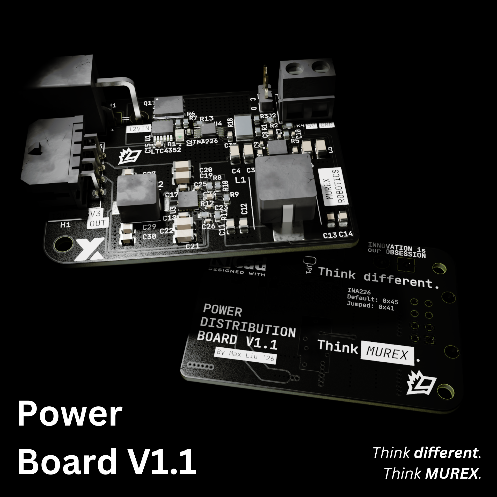

# Power Board

## Outline

The MUREX Power Board is among the world's smallest dual-output high power buck converters, reducing an input voltage of 12V to 5V and 3V3 respectively. An integrated current sensor and circuit protection combined with microscopic physical dimensions measuring 40mm x 56mm (1.6″ x 2.2″) renders the power board an elite feature of MUREX electronics.

## Detailed Description

The MUREX Power Board is a robust four-layer power distribution module designed for ROV/robotics and other high current applications. The board expects clean 12V input from a power supply through a horizontal Mega-fit connector, though it can safely handle input voltages up to 17V. The board utilizes two TPS568215 buck converters to provide 5V output to the [MUREX Carrier Board](https://docs.murexrobotics.com/elec/boards/carrier.html) and 12V + 3V3 output to the [ESC Carrier Board](https://docs.murexrobotics.com/elec/boards/esc_carrier.html). The TPS568215 features integrated MOSFETs, a default soft-start of 1ms, and a maximum output current of 8A. A LTC4352 Ideal Diode uses an external MOSFET to provide reverse polarity protection and shorting safeguards via a fast turn-off, and status LEDs indicate safe power input. Power monitoring is provided by Texas Instruments' INA226, a shunt-based power monitor interfaced through I2C, sensing current, voltage, and power. 

The board formerly featured an M.2 card edge (Key A) that would provide 5V and I2C lines to the [MUREX Carrier Board](https://docs.murexrobotics.com/elec/boards/carrier.html). However, this feature was removed due to an oversight with the M.2 module thickness. The board's current version includes a 5V screw terminal and I2C header pins to be connected with the [MUREX Carrier Board](https://docs.murexrobotics.com/elec/boards/carrier.html), and a horizontal Micro-Fit connector providing 12V + 3V3 to the [ESC Carrier Board](https://docs.murexrobotics.com/elec/boards/esc_carrier.html).

## Current Status

- `V1.1` Complete, partially tested
  - `V1.2` Revisions in progress

## Integrated Sensors and ICs

- [TPS568215RNNR x2](https://www.ti.com/product/TPS568215?dcmp=dsproject&hqs=pf) Buck Converter
  - 4.5V-17V input, 0.6V-5.5V output
  - Integrated MOSFETs
  - 8A maximum output current
  - Synchronous rectification, built in soft-start
  - ∼90-95% efficiency
- [LTC4352](https://www.analog.com/en/products/ltc4352.html) Analog Devices Ideal Diode
  - 2.9V-18V Input
  - Reverse current disabled by default
  - Si7336ADP used as external NMOS
  - Status LEDs: Everlight Electronics Green and Red Diodes
- [INA226](https://www.ti.com/product/INA226) Current, Voltage, Power Monitor
  - Shunt-resistor based
  - Voltage sensing from 0V-36V
  - Reports current, voltage, and power
  - Jumper enables backup I2C address
- [ACS712 (retired in V1.1)](https://www.allegromicro.com/en/products/sense/current-sensor-ics/zero-to-fifty-amp-integrated-conductor-sensor-ics/acs712) Current Sensor IC
  - Hall-effect based
  - Selected part optimized for ±30A measurements
  - Proportional analog output signal, conversion to measured current in datasheet

### [Schematic (PDF)](../pdf/schematics/power_v1.1_schematic.pdf)

### To Do

- [ ] Add microfit connector to Carrier Board
- [ ] Improve mounting mechanism
- [ ] INA226 testing

### Changelog

V1.0:

- Initial Design

V1.1:

- Removed M.2 connector to Carrier Board (Board Thickness > 0.8mm)
- Removed ACS712 Hall-Effect Sensor to save cost and board space
- Added AGND islands to reduce circulating currents
- Broke out INA226 I2C pins
- Switched 12VIN connector from Super Sabre to Mega-fit
- Fixed Si7336ADP polarity
