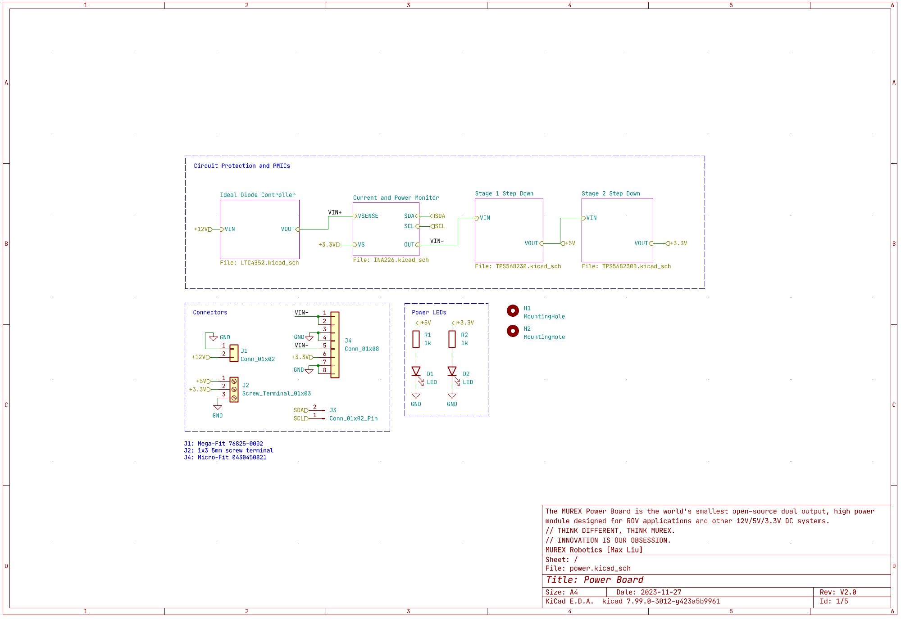

# Power Board

## Outline

The MUREX Power Board is the world's smallest open-source dual-output, high power module designed for 12V/5V/3.3V DC systems and ROV applications. An integrated current sensor and robust circuit protection combined with microscopic physical dimensions measuring 44mm x 46mm renders the power board an elite feature of MUREX electronics.

## Detailed Description

The MUREX Power Board is a compact four-layer power "integration" PCB designed for ROV/robotics and other high current applications. The board expects clean 12V input from a power supply through a horizontal Mega-fit connector, though it can safely handle input voltages up to 17V. The board utilizes two TPS568230 buck converters to provide 5V + 3.3V for the [MUREX Carrier Board](https://docs.murexrobotics.com/elec/boards/carrier.html), 3.3V for the [MUREX Ethernet Switch](https://docs.murexrobotics.com/elec/boards/networking/switch), and 12V + 3.3V for the [ESC Carrier Board](https://docs.murexrobotics.com/elec/boards/esc_carrier.html). A LTC4352 Ideal Diode Controller controls back-to-back SIRA00DP N-channel MOSFETs to provide reverse polarity protection, shorting safeguards, inrush current control, overvoltage and undervoltage protection, and status LEDs that indicate safe power input. Power monitoring is provided by Texas Instruments' INA226, a shunt-based power monitor interfaced through I2C, sensing current, voltage, and power.

## Current Status

- `V2.0` ordered and in production

## Integrated Sensors and ICs

- [TPS568230 x2](https://www.ti.com/product/TPS568230?dcmp=dsproject&hqs=pf) Synchronous Buck Converter
- [LTC4352](https://www.analog.com/en/products/ltc4352.html) Analog Devices Ideal Diode Controller
- [SIRA00DP x2](https://www.vishay.com/en/product/63780/) 30V 100A N-Channel Mosfet
- [INA226](https://www.ti.com/product/INA226) Current, Voltage, Power Monitor

- [TPS568215 x2 (retired in V2.0)](https://www.ti.com/product/TPS568215?dcmp=dsproject&hqs=pf) Buck Converter
- [ACS712 (retired in V1.1)](https://www.allegromicro.com/en/products/sense/current-sensor-ics/zero-to-fifty-amp-integrated-conductor-sensor-ics/acs712) Current Sensor IC

### [Schematic (PDF)](/pdf/schematics/power_v2.0_schematic.pdf)

### To Do

- [ ] `V2.0` assembling and testing

### Changelog

V1.0: 

- Initial Design

V1.1:

- Removed M.2 connector to Carrier Board (Board Thickness > 0.8mm)
- Removed ACS712 Hall-Effect Sensor to save cost and board space
- Added AGND islands to reduce circulating currents
- Broke out INA226 I2C pins
- Switched 12VIN connector from Super Sabre to Mega-fit
- Fixed Si7336ADP polarity

V2.0:

- Replaced TPS562815 with the TPS562830, a newer, smaller, more efficient alternative by TI
- Added inrush current control, undervoltage, and overvoltage protection configurations to the LTC4352 using back-to-back mosfets
- Added TVS diode for surge protection
- Replaced the Si7336ADP with the SIRA00DP, a newer solution by Vishay with lower Rds, minimal thermal resistance and higher power dissipation. No external heatsinks required
- Replaced 1x2 screw terminal with 1x3 terminal, breaking out 5V and 3.3V
- Added two mounting holes for stability
- Decreased physical footprint by 20%