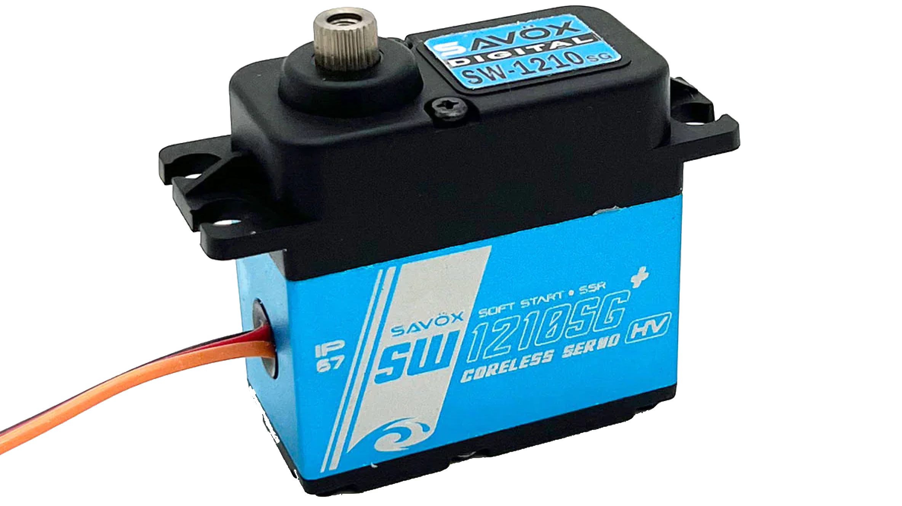

# Servos

> *Savox SW1210SGP Servo*

## Explanation

How a servo works and how to use it is incredibly well documented, [for example here.](https://www.sparkfun.com/servos)

There are three main types of servos:

- Positional Rotation
  - Most common, cheapest, rotates ~180˚
- Continuous Rotation
  - Infinite rotation, expensive and usually more prone to failure than positional rotation
- Linear Motion
  - Converts the usual rotational motion to linear motion

There is different constructions of servos (general surrounding positional rotation servos):

- Coreless
  - Coreless motors are an improvement on traditional brushed DC motors. They are lighter in weight, spin smoother and have faster response time.
- Brushless
  - There's a BLDC instead of a brushed DC motor. All the benefits of a BLDC comes with it (+ efficiency, + light, + quiet, + performance). As well as the downsides (+ cost, + complexity)

## Pros/Cons

Servos are a way to rotate things very easily. Of course, there are also BLDCs, stepper motors, and plain old brushed DC motors.

It is vital to make informed and rational decisions about motor choice. Thus, understanding the pros/cons of each motor type is paramount.

Servos are very advantageous in that their position can be accurately controlled, their torque is very high, and they are very simple to use. They are also very low in cost (> $50). However, **they are not fully waterproof**. Notice the [IP rating](./ip_ratings.md) labeled on the sample servo above. "IP67". Yes, they're "waterproof" as per IEC regulations, but not waterproof in our case. This doesn't cut it. Should we do away with servos then? Not exactly.

## Waterproofing

It seems that the only issue for servos is waterproofing, right? In short, yes. Of course, there is a lot more nuance (torque, connection, speed, heat, reliability, cost, etc.). But let's solve the waterproofing issue first.

The way MUREX will do it is a combination of [this tutorial](https://www.nankinhobby.com/easy-way-to-waterproof-rc-servos/) and [this tutorial](https://www.youtube.com/watch?v=iSKlw3ZUEwU).

**Quick steps:**

1. Unscrew bolts from bottom of servo.
2. Remove all electronics.
3. Coat with conformal coat and dry.
4. Reassemble servo
5. Place silicone grease (usually Molykote 111) around shaft.
6. Place a lubricated o-ring around shaft and tighten servo horn on it with a screw. This waterproofs the shaft with a rudimentary shaft seal.
7. Fill servo with diaelectric (insulating) liquid, usually mineral/olive oil. Make sure there are no air bubbles trapped.
8. Retighten bolts back to servo. Make sure the servo is filled with oil.
9. Epoxy all possible points of failure (seams, wire entry, screws, etc.).
10. Test servo on land, then in water.

The reasoning behind filling the servo with oil is to prevent water from entering the servo from the high pressure. Even though oil is lighter than water, it is much harder to be forced out than air. The conformal coating and epoxy are extra measures of protection against ingress.
